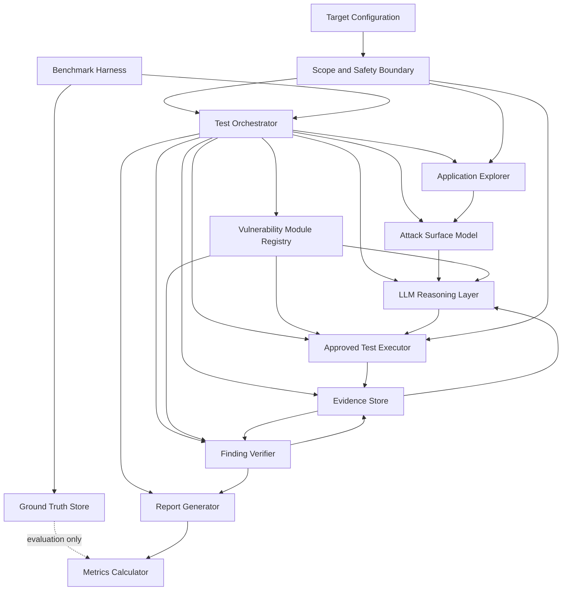
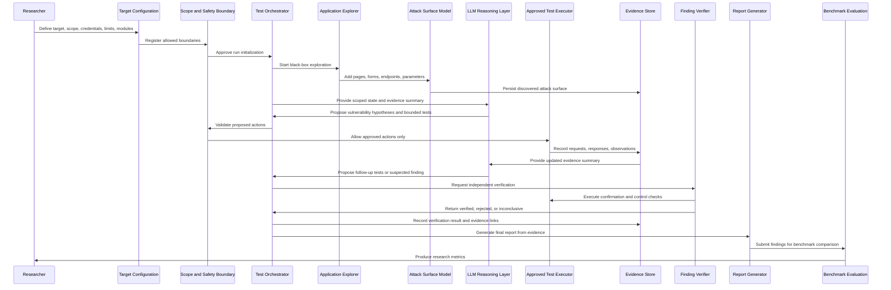

# Architecture Overview v0.2

## Thesis Context

Thesis title: **Design and Evaluation of an AI-Driven Framework for Automated Web Application Security Testing**

This project will design and evaluate an LLM-driven framework for authorized, controlled, black-box security testing of laboratory web applications. The framework is intended to behave like an intelligent QA engineer and penetration tester: it explores a target application, identifies the attack surface, generates vulnerability hypotheses, executes bounded tests through approved tools, collects evidence, verifies findings, and produces a final report.

The first MVP uses the following representative vulnerability categories to validate the architecture:

- Cross-site scripting, or XSS
- Broken access control / insecure direct object references, or IDOR
- SQL injection

These categories are not the final thesis scope. They are initial vulnerability modules used to prove that the core framework can support different kinds of web security testing. The orchestration, evidence, verification, and reporting mechanisms should remain general enough to support additional vulnerability-specific modules later.

Additional vulnerability categories must be addable through category-specific testing strategies, validators, and evidence requirements without redesigning the core framework. Future coverage may include:

- Authentication and session-management weaknesses
- Path traversal
- Server-side request forgery, or SSRF
- Command injection
- Sensitive information exposure
- Security misconfiguration

The framework must be designed for reproducible research and safe laboratory testing. It must not be designed as an unrestricted offensive system.

## Architecture Goals

The architecture should support:

- Controlled black-box testing against explicitly authorized targets.
- Evidence-grounded LLM reasoning rather than unbounded autonomous action.
- Separation between planning, execution, verification, and reporting.
- Extensible vulnerability-specific testing and verification modules.
- Reproducible evaluation against benchmark applications.
- Clear audit trails for every action, observation, hypothesis, and finding.
- Independent verification before a suspected vulnerability becomes a confirmed result.
- Isolation between benchmark ground truth and the testing agent.
- Deterministic behavior where possible, with heuristic or LLM-assisted decisions kept explicit, auditable, and evidence-backed.

## High-Level Architecture

## Major Components

### Target Configuration

Defines the target application and allowed testing scope.

Responsibilities:

- Store the target URL, allowed hosts, authentication assumptions, and test limits.
- Define which vulnerability modules are enabled for a run.
- Provide reset instructions for benchmark applications if available.
- Make the test scope explicit before any exploration or testing begins.

### Scope and Safety Boundary

Enforces what the framework is allowed to do.

Responsibilities:

- Reject requests outside the configured target scope.
- Limit request rates, payload categories, recursion depth, and test intensity.
- Prevent destructive actions unless explicitly enabled in a controlled benchmark.
- Record blocked actions as part of the audit trail.
- Ensure the LLM can propose actions but cannot bypass policy enforcement.

### Test Orchestrator

Coordinates the full testing lifecycle.

Responsibilities:

- Start, pause, resume, and stop a test run.
- Route information between exploration, reasoning, execution, verification, and reporting.
- Maintain test state across multiple steps.
- Detect when a hypothesis should be submitted for verification and route it to the Finding Verifier.
- Ensure benchmark-only data is never exposed to the testing agent.
- Load enabled vulnerability modules through a stable interface.

### Application Explorer

Maps the visible application from a black-box perspective.

Responsibilities:

- Discover pages, links, forms, parameters, API endpoints, and user flows.
- Capture HTTP requests, responses, browser states, and relevant page content.
- Identify input points, resources, roles, and workflows that vulnerability modules can evaluate.
- Send discovered information to the attack surface model.

### Attack Surface Model

Provides a structured representation of the target.

Responsibilities:

- Represent discovered routes, forms, parameters, resources, roles, sessions, and observations.
- Track which assets have been tested and which remain unexplored.
- Link inputs and endpoints to vulnerability hypotheses.
- Provide concise, structured context to the LLM reasoning layer.

### LLM Reasoning Layer

Generates hypotheses and proposes bounded next actions.

Responsibilities:

- Interpret the current attack surface.
- Generate vulnerability hypotheses for the enabled vulnerability modules.
- Prioritize tests based on available evidence and unexplored risk.
- Explain why a proposed test is relevant.
- Interpret tool output and propose follow-up verification steps.

The LLM reasoning layer must not directly execute network requests, bypass scope controls, access benchmark ground truth, or mark findings as independently verified.

### Vulnerability Module Registry

Provides a stable extension point for vulnerability-specific logic.

Responsibilities:

- Register available vulnerability modules.
- Expose each module's supported hypothesis types, testing strategy, validators, test actions, evidence requirements, verification rules, and report fields.
- Allow the orchestrator to enable or disable modules per test run.
- Keep vulnerability-specific behavior outside the core orchestration, evidence, and reporting mechanisms.

Initial MVP modules:

- XSS module
- Broken access control / IDOR module
- SQL injection module

Future modules should be added by implementing the same conceptual contract rather than changing the core framework, evidence model, verification lifecycle, or reporting pipeline.

### Approved Test Executor

Runs deterministic, bounded actions selected from an approved set.

Responsibilities:

- Execute browser actions, HTTP requests, payload submissions, and approved security checks.
- Enforce input validation and safety policies before execution.
- Normalize outputs for the evidence store.
- Avoid exposing raw execution control directly to the LLM.

### Evidence Store

Maintains the factual record of a test run.

Responsibilities:

- Store discovered assets, observations, hypotheses, executed actions, responses, screenshots if used, and generated findings.
- Preserve enough detail to reproduce every confirmed finding.
- Track confidence, severity, affected locations, and verification status.
- Store module-specific evidence as structured extensions linked to common finding records.
- Support later evaluation and report generation.

### Finding Verifier

Determines whether a suspected vulnerability is independently confirmed.

Responsibilities:

- Determine whether available and newly collected evidence satisfies the verification criteria for the relevant vulnerability module.
- Reproduce suspected issues using deterministic checks where possible.
- Compare vulnerable and non-vulnerable control cases.
- Confirm exploitability without relying only on LLM interpretation.
- Record the evidence required for a finding to move from suspected to verified.
- Apply verification rules provided by the relevant vulnerability module.
- Reject or downgrade findings when verification fails.

The Finding Verifier owns the decision about whether evidence is sufficient to classify a suspected vulnerability as `verified`, `rejected`, or `inconclusive`. The Test Orchestrator records this result and selects the next workflow state, but it does not independently certify findings.

### Report Generator

Produces human-readable and machine-readable outputs.

Responsibilities:

- Summarize scope, methodology, findings, evidence, reproduction steps, and remediation guidance.
- Distinguish suspected, verified, rejected, and inconclusive findings.
- Map findings to vulnerability categories.
- Render module-specific evidence through a common report structure.
- Preserve traceability back to the evidence collected during testing.

### Benchmark Harness

Runs repeatable experiments against laboratory targets.

Responsibilities:

- Start and reset benchmark applications.
- Run the framework and baseline tools under comparable conditions.
- Collect run metadata such as time limits, enabled modules, and tool budgets.
- Pass final results to the metrics calculator.

### Ground Truth Store

Contains known benchmark vulnerabilities and expected results.

Responsibilities:

- Store expected vulnerabilities for benchmark applications.
- Support precision, recall, and false positive analysis.
- Remain isolated from the LLM reasoning layer, application explorer, and test executor.

### Metrics Calculator

Evaluates research results after a run is complete.

Responsibilities:

- Compare generated findings against benchmark ground truth.
- Compute metrics such as true positives, false positives, false negatives, precision, recall, and time to first verified finding.
- Support repeated trials for reproducibility analysis.

## Component Classification

### LLM Reasoning Components

These components use language-model reasoning and should be treated as probabilistic:

- LLM Reasoning Layer
- Vulnerability-specific reasoning prompts or instructions
- Hypothesis generation
- Test prioritization
- Tool-output interpretation
- Report drafting assistance

These components may suggest actions and explain reasoning, but their output must be validated by deterministic controls before it is trusted. Any heuristic or LLM-assisted decision must be represented explicitly in the evidence trail, including the input context, proposed rationale, selected action, and observed result.

### Deterministic Components

These components should behave predictably where possible and should be testable with conventional software tests:

- Target Configuration
- Scope and Safety Boundary
- Test Orchestrator state transitions
- Application Explorer mechanics
- Attack Surface Model
- Vulnerability Module Registry
- Approved Test Executor
- Evidence Store
- Finding Verifier
- Report Generator formatting
- Metrics Calculator

Some deterministic components may consume heuristic inputs, such as LLM-generated hypotheses. In those cases, the component should treat the input as untrusted data and record how it was accepted, rejected, transformed, or routed.

### Security-Sensitive Components

These components require extra care because defects could cause unsafe behavior or invalid research results:

- Scope and Safety Boundary
- Approved Test Executor
- Authentication and session handling
- Payload policy and test-intensity controls
- Vulnerability module action definitions
- Vulnerability module verification rules
- Evidence Store integrity
- Finding Verifier
- Benchmark reset logic

### Benchmark-Only Components With Ground Truth Access

These components may access known vulnerabilities, expected answers, or labels:

- Ground Truth Store
- Metrics Calculator
- Benchmark Harness evaluation phase

Ground truth must not be available to:

- LLM Reasoning Layer
- Application Explorer
- Approved Test Executor
- Finding Verifier during normal test execution
- Report Generator before evaluation labels are calculated

## Complete Testing Workflow

## From Suspected Vulnerability to Verified Finding

A suspected vulnerability is an LLM-generated, module-generated, or tool-generated claim that may be true but is not yet trusted.

To become independently verified, the Finding Verifier must determine that the finding satisfies all applicable criteria:

- It is linked to a specific endpoint, page, parameter, role, or workflow.
- The triggering request or browser action is stored.
- The observed vulnerable behavior is captured as evidence.
- A deterministic verification step reproduces the behavior.
- A control case reduces the chance that the result is coincidental.
- The finding can be explained without relying solely on the LLM's interpretation.
- The result stays within the authorized test scope.

Initial MVP examples:

- For XSS, verification may require showing that a submitted payload is reflected or stored and executed in a controlled browser context.
- For IDOR, verification may require showing that one user can access or modify another user's resource, while a legitimate access-control comparison is available.
- For SQL injection, verification may require showing a consistent difference between control and test payloads, without destructive database actions.

Future vulnerability modules should define equivalent verification criteria before they can produce verified findings.

Possible finding states:

- `suspected`: a potential issue was identified but not verified.
- `verified`: independent evidence confirms the issue.
- `rejected`: verification failed or contradicted the hypothesis.
- `inconclusive`: evidence is insufficient, unstable, or blocked by scope limits.

## Safety Boundaries

The framework should enforce the following safety boundaries:

- Test only explicitly configured laboratory targets.
- Require an allowlist of hosts and ports.
- Block requests to out-of-scope domains, private infrastructure not explicitly configured, and external callback endpoints unless intentionally approved for a lab.
- Enforce request-rate limits and maximum run duration.
- Use bounded payload libraries for enabled vulnerability modules.
- Avoid destructive payloads, persistence mechanisms, privilege escalation outside the lab, denial-of-service behavior, malware-like behavior, and credential theft.
- Keep benchmark credentials and test accounts separate from personal or production credentials.
- Log all actions, blocked actions, and findings.
- Keep the LLM behind controlled interfaces rather than giving it unrestricted shell, browser, or network access.

## Evaluation Considerations

The architecture should support comparison against traditional security testing approaches.

Useful evaluation dimensions include:

- Number of verified vulnerabilities found.
- Precision and recall against benchmark ground truth.
- False positive and false negative rates.
- Time to first verified finding.
- Coverage of routes, forms, parameters, and roles.
- Reproducibility across repeated runs.
- Quality and actionability of generated reports.
- Cost or resource usage per verified finding.

The evaluation should distinguish between:

- Vulnerabilities discovered by deterministic tools.
- Vulnerabilities hypothesized by the LLM but not verified.
- Vulnerabilities verified by the framework.
- Vulnerabilities known from ground truth but missed by the framework.
